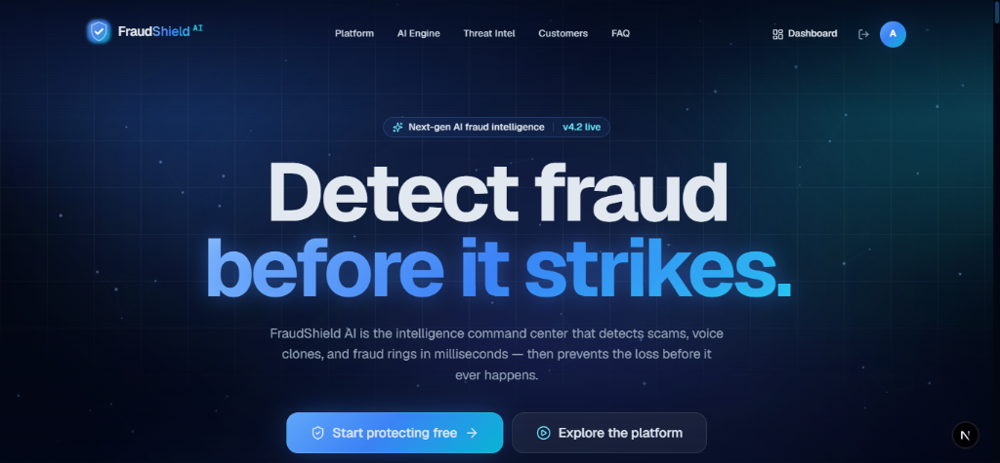
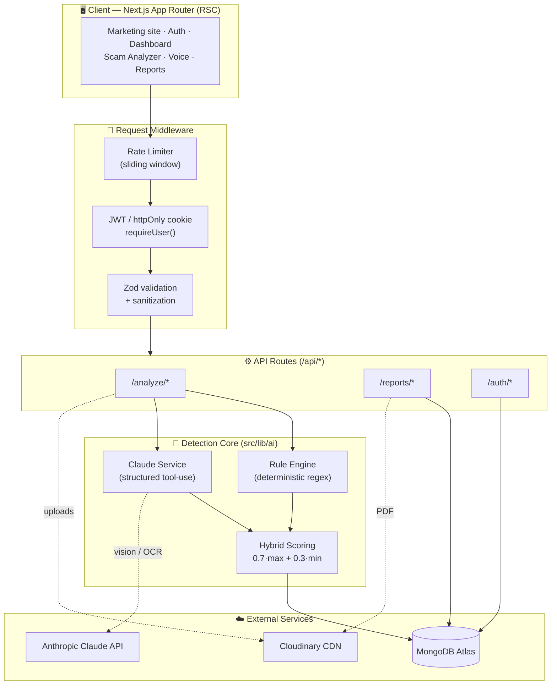
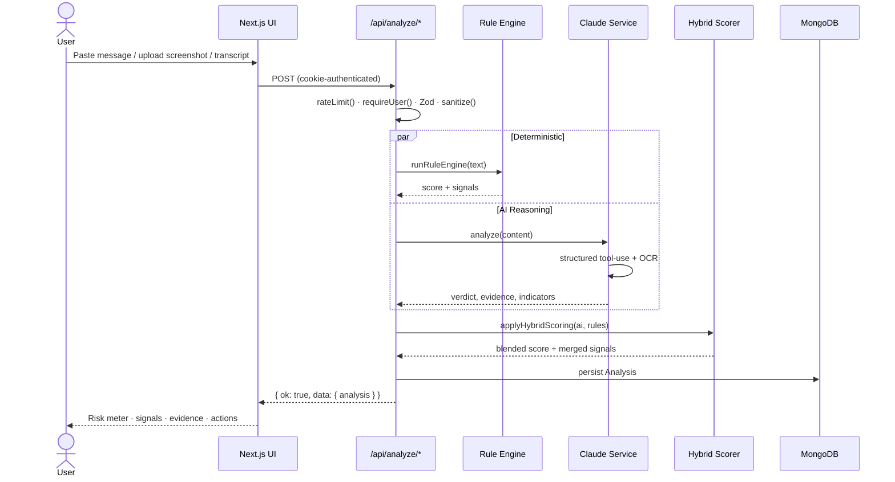
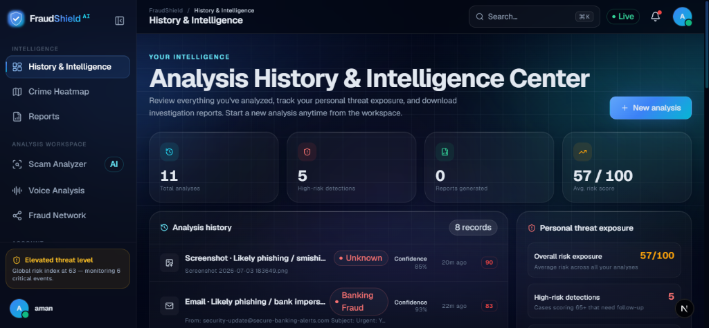
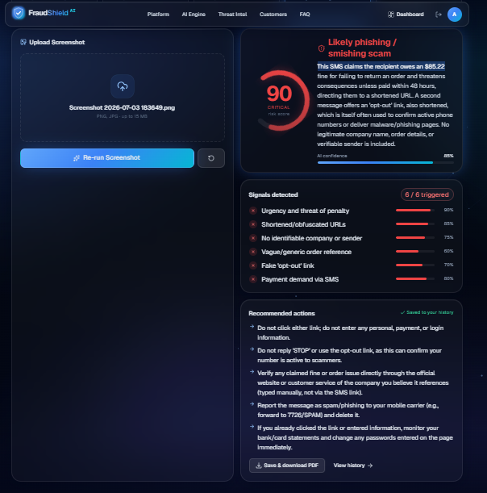
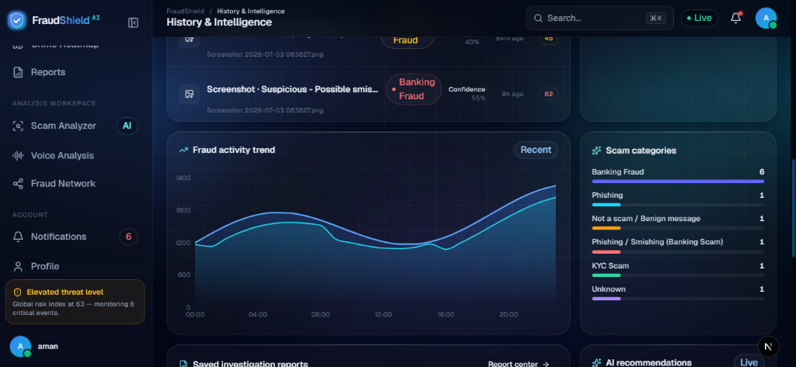
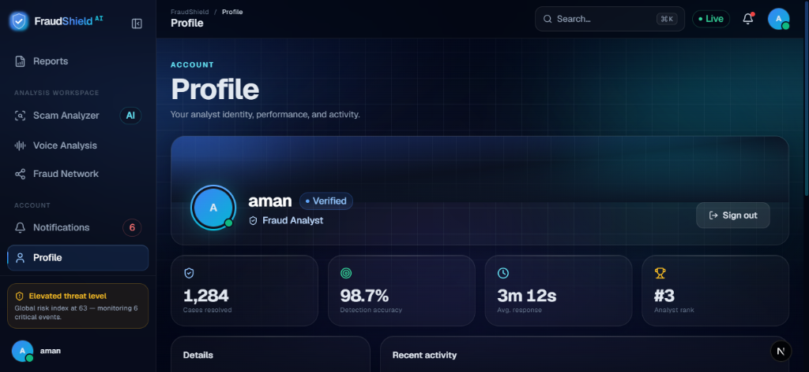
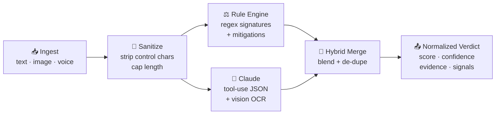

<!-- ══════════════════════════════════════════════════════════════ -->
<!--                        F R A U D S H I E L D   A I               -->
<!-- ══════════════════════════════════════════════════════════════ -->

<div align="center">

<br />

<!-- LOGO -->


<br />
<br />

<h1>
  🛡️ FraudShield&nbsp;AI
</h1>

### **Detect. Prevent. Protect.**

**Investigation-grade AI that reads a scam the way a forensic analyst would — and shows its work.**

FraudShield AI ingests messages, emails, screenshots and voice-call transcripts, then returns an
explainable, evidence-backed fraud verdict powered by a **hybrid Claude + deterministic rule engine**.

<br />

<!-- BADGES -->
[](https://nextjs.org/)
[](https://react.dev/)
[](https://www.typescriptlang.org/)
[](https://tailwindcss.com/)
[](https://www.mongodb.com/atlas)
[](https://www.anthropic.com/)

[](#-license)
[](#-contributing)
[]()
[]()
[]()

<br />

[**Overview**](#-overview) · [**Features**](#-key-features) · [**Architecture**](#-architecture-overview) · [**API**](#-api-documentation) · [**Install**](#-installation-guide) · [**Roadmap**](#-roadmap)

</div>

<br />

---

## 📖 Overview

> [!IMPORTANT]
> **FraudShield AI is an investigation-grade fraud detection platform — not a spam filter.**
> Every verdict ships with a risk score, a confidence score, extracted evidence, a weighted signal
> breakdown, and recommended actions. It is built to be defensible in a real investigation.

FraudShield AI analyzes the surfaces where modern fraud actually lands — **SMS and chat messages,
emails, screenshots, and voice-call transcripts** — and classifies phishing, social engineering,
banking fraud, KYC fraud, investment scams, digital-arrest scams, impersonation, and more.

Under the hood it fuses two independent detection systems:

- **🧠 AI reasoning** — Anthropic **Claude** performs forensic analysis with **structured tool-use
  output**, extracting concrete evidence (URLs, phone numbers, UPI IDs, amounts, bank names) and
  reading on-screen text from screenshots via vision-based OCR.
- **⚖️ Deterministic rule engine** — a transparent, regex-driven scorer that catches known fraud
  signatures with fixed, auditable weights — and guarantees a useful result even when the AI layer
  is unavailable.

The two scores are combined by a **Hybrid Risk Engine**, so the platform is *both* smart *and*
predictable — a requirement for anything security teams are willing to trust.

<div align="center">

| | |
|---|---|
| 🎯 **Category** | AI-Powered Fraud Detection & Investigation |
| 🧩 **Type** | Full-stack web platform (Next.js App Router) |
| 🔬 **AI Layer** | Anthropic Claude · Hybrid Risk Engine · Vision OCR |
| 🗄️ **Data** | MongoDB Atlas · Mongoose ODM |
| 🔐 **Auth** | JWT · bcrypt · httpOnly session cookies |
| 📄 **Output** | Explainable reports · PDF export |

</div>

<br />

## 💡 Why FraudShield AI Exists

Fraud stopped looking like fraud. The classic tells — broken English, an obvious malicious link —
are gone. Today's attacks are **reply-based smishing** with no URL at all, **AI-cloned voices** of
family members, **pixel-perfect banking screenshots**, and **digital-arrest scams** where a fake
"police officer" keeps a victim on a call for hours.

Most tools give a binary answer: *spam* or *not spam*. That is useless in an investigation. An
analyst needs to know **why**, **how sure**, and **what to do next**.

FraudShield AI was built around three convictions:

1. **A verdict without a reason is worthless.** Every score is decomposed into named, weighted signals.
2. **AI alone is not trustworthy enough for security.** Pair it with deterministic rules and blend.
3. **Detection must degrade gracefully.** No API key? The rule engine keeps every feature alive.

<br />

## 🎯 Problem Statement

<table>
<tr>
<th width="50%">The Reality</th>
<th width="50%">How FraudShield AI Responds</th>
</tr>
<tr>
<td>Scam messages increasingly contain <b>no links</b> — they rely on "reply YES" social engineering.</td>
<td>Rule engine flags <b>reply-based requests</b> and <b>credential asks</b> independently of URLs.</td>
</tr>
<tr>
<td>Screenshots of fake payments and bank alerts spread faster than text.</td>
<td><b>Vision OCR</b> reads on-screen text, then scores impersonation and urgency framing.</td>
</tr>
<tr>
<td>Voice deepfakes impersonate banks, police, and relatives.</td>
<td>Transcript analysis detects <b>authority impersonation</b> and known <b>scam scripts</b>.</td>
</tr>
<tr>
<td>Black-box classifiers can't be audited or explained to a victim.</td>
<td><b>Explainable AI</b> — weighted signals, confidence reasoning, evidence trail.</td>
</tr>
<tr>
<td>AI models hallucinate and can be manipulated into under-scoring real threats.</td>
<td><b>Hybrid scoring</b> takes the higher of AI/rule scores at 70% weight; hard scoring rules.</td>
</tr>
</table>

<br />

## ✨ Key Features

<table>
<tr>
<td width="33%" valign="top">

### 🔍 Multi-Surface Analysis
Analyze **messages, emails, screenshots, and voice transcripts** through one consistent pipeline and verdict schema.

</td>
<td width="33%" valign="top">

### 🧠 Hybrid Risk Engine
Blends **Claude reasoning** with a **deterministic rule scorer** — smart *and* predictable, with graceful degradation.

</td>
<td width="33%" valign="top">

### 🪟 Explainable AI
Every verdict decomposes into **named, weighted signals** with per-signal risk impact and plain-English reasoning.

</td>
</tr>
<tr>
<td width="33%" valign="top">

### 🖼️ Vision OCR
Reads text directly out of **scam screenshots** — spoofed sender IDs, fake receipts, phishing pages.

</td>
<td width="33%" valign="top">

### 📊 Dual Scoring
**Risk** (how dangerous) and **Confidence** (how certain) are computed *separately* — never conflated.

</td>
<td width="33%" valign="top">

### 🧾 Investigation Reports
Compile multiple analyses into a formal report and **export to PDF** for evidence and escalation.

</td>
</tr>
<tr>
<td width="33%" valign="top">

### 🏷️ Threat Classification
Auto-tags each case: Banking, UPI, OTP, KYC, Investment, Digital Arrest, Tech Support, Romance, Lottery…

</td>
<td width="33%" valign="top">

### 🕵️ Evidence Extraction
Pulls **URLs, phones, emails, UPI IDs, amounts, and bank names** into a structured evidence array.

</td>
<td width="33%" valign="top">

### 🔐 Secure by Default
JWT + bcrypt, **httpOnly cookies**, Zod validation, input sanitization, and per-route rate limiting.

</td>
</tr>
</table>

<br />

## 🏗️ Architecture Overview

FraudShield AI is a single **Next.js (App Router)** application: React Server Components render the
UI, and colocated **API Routes** provide the backend. There is no separate server to deploy.



**Design principles**

- 🧩 **Centralized AI** — every model call routes through one service (`src/lib/ai/claude.ts`).
- 🛟 **Graceful degradation** — no `ANTHROPIC_API_KEY`? The rule engine answers. No Cloudinary? Inline data-URLs.
- 📐 **One verdict schema** — messages, emails, images and voice all normalize to the same `AiAnalysis` shape.
- ♻️ **Cached connections** — a global Mongoose cache reuses one pooled connection across invocations.

<br />

## 🔄 System Workflow

From raw input to a stored, explainable verdict:



<br />

## 📸 Screenshots

<div align="center">

### Landing / Hero


### Intelligence Dashboard


### Scam Analyzer — Explainable Verdict


<table>
<tr>
<td width="50%"></td>
<td width="50%"></td>
</tr>
</table>

</div>

<br />

## 🎬 Demo

> [!TIP]
> **Try these live in the Scam Analyzer** to watch the hybrid engine light up in real time.

<table>
<tr><th>Paste this</th><th>Expected verdict</th></tr>
<tr>
<td><code>URGENT: Your YourBank account is suspended. Verify your KYC now or it will be closed. Reply YES to continue.</code></td>
<td>🔴 <b>Critical</b> — generic bank identity + KYC pressure + urgency + reply-based request</td>
</tr>
<tr>
<td><code>Congratulations! You WON a $5,000 lottery. Send a $50 gift card processing fee to claim.</code></td>
<td>🔴 <b>Critical</b> — lottery/prize + irreversible payment demand</td>
</tr>
<tr>
<td><code>Hi, are we still on for lunch at 1pm tomorrow?</code></td>
<td>🟢 <b>Safe</b> — no fraud indicators triggered</td>
</tr>
</table>

**Quick start:**

```bash
git clone https://github.com/girishivansh/fraudshield.git
cd fraudshield
cp .env.example .env.local     # add MONGODB_URI (required)
npm install
npm run dev                     # → http://localhost:3000
```

Register an account → open **Scam Analyzer** → paste a sample → inspect the signal breakdown → **generate a PDF report**.

<br />

## 🧰 Tech Stack

<table>
<tr>
<td valign="top" width="33%">

**Frontend**
- Next.js 16 (App Router, RSC)
- React 19
- TypeScript 5
- Tailwind CSS 3
- Framer Motion
- Recharts
- Lucide Icons · Geist Font

</td>
<td valign="top" width="33%">

**Backend**
- Next.js API Routes
- MongoDB Atlas + Mongoose 9
- JWT (`jsonwebtoken`)
- bcryptjs
- Zod validation
- `pdf-lib` (report export)
- Cloudinary (media CDN)

</td>
<td valign="top" width="33%">

**AI Layer**
- Anthropic Claude (`@anthropic-ai/sdk`)
- Structured tool-use output
- Vision-based OCR
- Deterministic Rule Engine
- Hybrid Risk Scoring
- Heuristic fallback engine

</td>
</tr>
</table>

<br />

## 📊 Risk Scoring System

Risk is a **0–100** score mapped to five semantic levels. **Risk** (danger) and **Confidence**
(certainty) are always computed independently — a scam can be obvious (high risk, high confidence)
or ambiguous (moderate risk, low confidence).

| Score | Level | Badge | Meaning | Recommended Posture |
|:-----:|:------|:-----:|:--------|:--------------------|
| **80–100** | `critical` | 🔴 | Active, high-confidence fraud | Block, report, do not engage |
| **60–79** | `high` | 🟠 | Strong fraud indicators present | Treat as hostile; verify out-of-band |
| **40–59** | `suspicious` | 🟡 | Mixed / concerning signals | Manual review before acting |
| **20–39** | `low` | 🔵 | Minor indicators only | Stay alert; verify sender |
| **0–19** | `safe` | 🟢 | No known indicators | Proceed with normal caution |

### The Hybrid Scoring Formula

When both engines run, the final score **favors the more alarming signal** — because in security,
false negatives cost more than false positives:

```
blendedScore = round( max(aiScore, ruleScore) × 0.7  +  min(aiScore, ruleScore) × 0.3 )
```

Indicators from both engines are then **merged and de-duplicated** — Claude's rich explanations win
on conflict, while the rule engine's explicit `riskImpact` weights are preserved.

### Deterministic Rule Weights (excerpt)

The rule engine is fully auditable. A sample of its signature weights:

| Signal | Risk Impact | Example trigger |
|:-------|:-----------:|:----------------|
| Irreversible payment demand | **+40** | gift card, crypto, wire transfer |
| Credential request | **+35** | password, OTP, PIN, CVV |
| Lottery / prize claim | **+35** | won, winner, lottery, prize |
| Investment guarantee | **+35** | "100% return", risk-free |
| Authority impersonation | **+30** | police, IRS, CBI, FBI |
| Remote support request | **+30** | AnyDesk, TeamViewer |
| Generic bank identity | **+25** | "YourBank", "my bank" |
| KYC / verification pressure | **+25** | KYC, "verify your account", suspend |
| Reply-based request | **+20** | "reply YES", "call us at" |
| URL shortener | **+20** | bit.ly, tinyurl |
| _Official verified domain_ | **−15** | `@chase.com`, `@sbi.co.in` |
| _Account-specific detail_ | **−10** | "account ending in 4821" |

> **Escalation floors:** ≥5 hits forces a minimum score of 60; ≥3 hits forces a minimum of 40 —
> so a message stuffed with weak signals can never slip through as "safe".

<br />

## 🏷️ Threat Categories

Every analysis is classified into a primary threat category:

<div align="center">

| 🏦 Banking Fraud | 💸 UPI Scam | 🔢 OTP Scam | 🪪 KYC Scam |
|:---:|:---:|:---:|:---:|
| **💼 Job Scam** | **📈 Investment Scam** | **🚔 Digital Arrest Scam** | **🖥️ Tech Support Scam** |
| **❤️ Romance Scam** | **🎰 Lottery Scam** | **📦 Delivery / Package Scam** | **❓ Unknown** |

</div>

<br />

## 🧠 AI Detection Pipeline

Every input is normalized into a single verdict schema through a five-stage pipeline:



1. **Ingest** — text, a screenshot (base64/URL), or a voice transcript.
2. **Sanitize** — strip control characters, cap length (Zod-enforced bounds per input type).
3. **Rule Engine** — deterministic regex signatures + mitigating rules → score & signals.
4. **Claude** — structured `tool_use` call forces valid JSON: verdict, evidence, fraud & legitimate
   indicators, recommendations, and OCR text for images.
5. **Hybrid Merge** — blend scores, merge signals, persist to MongoDB, return the verdict.

> [!NOTE]
> The Claude call uses **forced tool-use** (`tool_choice: { type: "tool" }`) so the model *must*
> return schema-valid output — with a JSON-extraction fallback and, ultimately, the deterministic
> engine if the API is unreachable. Detection never hard-fails.

<br />

## 🪟 Explainable AI Framework

Black boxes don't survive an investigation. Every FraudShield verdict exposes its full reasoning:

| Layer | What it answers | Field(s) |
|:------|:----------------|:---------|
| **Executive Summary** | *"What is this, in one line?"* | `executiveSummary`, `verdict` |
| **Risk Score** | *"How dangerous?"* | `riskScore` (0–100), `level` |
| **Confidence** | *"How certain are we?"* | `confidence` (0–1), `confidenceReasoning` |
| **Signal Breakdown** | *"Which specific patterns fired?"* | `indicators[]` — label · weight · `riskImpact` · explanation |
| **Evidence Trail** | *"What concrete artifacts were found?"* | `evidence[]` — URLs, phones, emails, UPI, amounts |
| **OCR Text** | *"What did the screenshot actually say?"* | `ocrText` |
| **Recommendations** | *"What should I do now?"* | `recommendations[]` |

Each indicator carries both a **positive risk impact** (fraud signal) or a **negative one**
(mitigating factor), so users see exactly what pushed the score up *and* what pulled it down.

<br />

## 🔐 Security Features

> [!WARNING]
> FraudShield AI handles sensitive fraud data. Security is layered across authentication, transport,
> validation, and rate control.

| Control | Implementation |
|:--------|:---------------|
| 🔑 **Password hashing** | `bcryptjs` with per-user salt; `password` field is `select:false` (never returned) |
| 🎫 **Session tokens** | JWT signed with `JWT_SECRET`, 7-day expiry |
| 🍪 **Cookie hardening** | `httpOnly`, `sameSite=lax`, `secure` in production, scoped path |
| 🛡️ **Auth guard** | `requireUser()` throws `401` on every protected route |
| ✅ **Input validation** | Zod schemas per endpoint + control-character sanitization |
| 🚦 **Rate limiting** | Sliding-window limiter per IP + bucket (`login: 15`, `analyze: 30–40`, `report: 20` / min) |
| 📦 **Upload guards** | MIME + size caps (images 15 MB, audio 25 MB) |
| 🧯 **Safe errors** | Centralized handler normalizes Zod / API / Mongo errors — no stack leakage |
| 🙈 **Secret hygiene** | All keys in `.env.local` (gitignored); optional services fail closed to safe fallbacks |

<br />

## ⚙️ Installation Guide

### Prerequisites

- **Node.js ≥ 18** (developed on v24)
- A **MongoDB** connection string (Atlas or local)
- *(Optional)* **Anthropic API key** — enables live Claude analysis (heuristic fallback without it)
- *(Optional)* **Cloudinary** account — hosts uploaded media (inline data-URL fallback without it)

### Steps

```bash
# 1 — Clone
git clone https://github.com/girishivansh/fraudshield.git
cd fraudshield

# 2 — Install dependencies
npm install

# 3 — Configure environment
cp .env.example .env.local
#   → open .env.local and set MONGODB_URI (required)

# 4 — Run the dev server
npm run dev        # http://localhost:3000

# 5 — Production build
npm run build && npm run start
```

<br />

## 🔧 Environment Variables

Only `MONGODB_URI` is strictly required — everything else has a safe fallback so the app runs
end-to-end out of the box.

| Variable | Required | Description |
|:---------|:--------:|:------------|
| `MONGODB_URI` | ✅ | MongoDB Atlas / local connection string |
| `JWT_SECRET` | ⚠️ | Secret for signing session JWTs — **set a long random string in production** |
| `ANTHROPIC_API_KEY` | ➖ | Enables live Claude analysis; omit to use the deterministic engine |
| `ANTHROPIC_BASE_URL` | ➖ | Override the Anthropic API base URL (proxies / gateways) |
| `CLOUDINARY_URL` | ➖ | Single-string Cloudinary credential for media hosting |
| `CLOUDINARY_CLOUD_NAME` | ➖ | Cloudinary cloud name (discrete form) |
| `CLOUDINARY_API_KEY` | ➖ | Cloudinary API key (discrete form) |
| `CLOUDINARY_API_SECRET` | ➖ | Cloudinary API secret (discrete form) |

```bash
# .env.local
MONGODB_URI="mongodb+srv://<user>:<pass>@<cluster>/fraudshield?retryWrites=true&w=majority"
JWT_SECRET="change-me-to-a-long-random-string"
ANTHROPIC_API_KEY=""          # optional
CLOUDINARY_URL=""             # optional
```

<br />

## 🚀 Usage Examples

All API responses share a single envelope: `{ ok: true, data }` on success, `{ ok: false, error }`
on failure. Analysis endpoints require an authenticated session cookie.

**Analyze a message**

```bash
curl -X POST http://localhost:3000/api/analyze/message \
  -H "Content-Type: application/json" \
  -b "fs_token=<session-cookie>" \
  -d '{ "input": "URGENT: verify your KYC now or your account will be suspended. Reply YES." }'
```

**Analyze a screenshot** (multipart)

```bash
curl -X POST http://localhost:3000/api/analyze/image \
  -b "fs_token=<session-cookie>" \
  -F "file=@scam-screenshot.png" \
  -F "note=Received from unknown WhatsApp number"
```

**Generate an investigation report** (aggregates your recent analyses → PDF)

```bash
curl -X POST http://localhost:3000/api/reports/generate \
  -H "Content-Type: application/json" \
  -b "fs_token=<session-cookie>" \
  -d '{ "title": "Q3 Smishing Campaign" }'
```

**Sample response**

```jsonc
{
  "ok": true,
  "data": {
    "analysis": {
      "id": "665f...c21a",
      "type": "message",
      "verdict": "Likely phishing",
      "riskScore": 92,
      "level": "critical",
      "confidence": 0.94,
      "category": "KYC Scam",
      "evidence": [{ "type": "Action", "value": "Reply YES" }],
      "indicators": [
        { "label": "KYC/Verification pressure", "weight": 0.25, "hit": true, "riskImpact": 25,
          "explanation": "Message pressures immediate KYC verification under threat of suspension." },
        { "label": "Reply-based request", "weight": 0.20, "hit": true, "riskImpact": 20,
          "explanation": "Asks the user to reply YES — classic no-link smishing." }
      ],
      "recommendations": ["Do not reply", "Contact your bank via its official number", "Report as phishing"]
    }
  }
}
```

<br />

## 📡 API Documentation

**Base URL:** `/api` · **Auth:** httpOnly `fs_token` cookie · **Envelope:** `{ ok, data | error }`

### 🔐 Authentication

| Method | Endpoint | Body | Description |
|:------:|:---------|:-----|:------------|
| `POST` | `/api/auth/register` | `name, email, password, company?` | Create account, issue session |
| `POST` | `/api/auth/login` | `email, password` | Authenticate, set cookie |
| `POST` | `/api/auth/logout` | — | Clear session cookie |
| `GET`  | `/api/auth/me` | — | Current authenticated user |

### 🔬 Analysis

| Method | Endpoint | Payload | Description |
|:------:|:---------|:--------|:------------|
| `POST` | `/api/analyze/message` | `{ input }` (JSON) | Analyze an SMS / chat message |
| `POST` | `/api/analyze/email`   | `{ input }` (JSON) | Analyze an email (headers + body) |
| `POST` | `/api/analyze/image`   | `file, note?` (multipart, ≤15 MB) | OCR + analyze a screenshot |
| `POST` | `/api/analyze/voice`   | `file?, transcript?` (multipart, ≤25 MB) | Analyze a voice-call transcript |

### 📈 Intelligence & Reports

| Method | Endpoint | Description |
|:------:|:---------|:------------|
| `GET`    | `/api/dashboard` | Aggregated metrics & threat feed |
| `GET`    | `/api/history` | Authenticated user's analysis history |
| `GET`    | `/api/reports` | List generated investigation reports |
| `POST`   | `/api/reports/generate` | Compile analyses → report → PDF |
| `GET`    | `/api/reports/{id}` | Fetch a single report |
| `DELETE` | `/api/reports/{id}` | Delete a report |
| `GET`    | `/api/reports/{id}/download` | Download the report PDF |

**Status codes:** `200/201` success · `400` validation · `401` unauthenticated · `404` not found ·
`409` duplicate email · `429` rate-limited · `500` server error.

<br />

## 🗂️ Project Structure

```
fraudshield/
├── public/
│   └── screenshots/              # Product imagery used across the app & docs
├── src/
│   ├── app/
│   │   ├── (auth)/               # login · register · verify-otp · forgot-password
│   │   ├── (app)/                # Authenticated workspace (route group)
│   │   │   ├── dashboard/        # History & intelligence
│   │   │   ├── scam-analyzer/    # Message / email / screenshot analysis
│   │   │   ├── voice-analysis/   # Voice-call transcript analysis
│   │   │   ├── fraud-network/    # Relationship graph
│   │   │   ├── crime-heatmap/    # Geographic threat map
│   │   │   ├── reports/          # Investigation reports
│   │   │   ├── notifications/    # Alerts
│   │   │   └── profile/          # Account settings
│   │   ├── api/
│   │   │   ├── auth/             # register · login · logout · me
│   │   │   ├── analyze/          # message · email · image · voice
│   │   │   ├── reports/          # list · generate · [id] · [id]/download
│   │   │   ├── dashboard/        # aggregate metrics
│   │   │   └── history/          # analysis history
│   │   ├── layout.tsx            # Root layout
│   │   └── page.tsx              # Marketing landing page
│   ├── components/
│   │   ├── ui/                   # Design-system primitives (button, card, risk-meter…)
│   │   ├── dashboard/            # Charts, feeds, graphs, waveform
│   │   ├── marketing/            # Hero, features, testimonials, FAQ
│   │   ├── auth/                 # Auth cards, OTP input, context
│   │   ├── backgrounds/          # Aurora, grid, particles, noise
│   │   └── motion/               # Framer-motion helpers
│   ├── lib/
│   │   ├── ai/
│   │   │   ├── claude.ts         # ⭐ Centralized Claude service (structured output)
│   │   │   └── rule-engine.ts    # ⭐ Deterministic regex scorer
│   │   ├── auth.ts               # JWT · bcrypt · session cookies
│   │   ├── db.ts                 # Cached Mongoose connection
│   │   ├── validation.ts         # Zod schemas + sanitizer
│   │   ├── rate-limit.ts         # Sliding-window limiter
│   │   ├── cloudinary.ts         # Media upload (with fallback)
│   │   ├── pdf.ts                # PDF report generation (pdf-lib)
│   │   ├── serialize.ts          # DB doc → API DTO
│   │   └── api.ts                # Response & error helpers
│   ├── models/
│   │   ├── User.ts               # Account (bcrypt hash, role)
│   │   ├── Analysis.ts           # A single fraud analysis
│   │   └── Report.ts             # A compiled investigation report
│   └── hooks/                    # use-media-query · use-mounted
├── .env.example
└── package.json
```

<br />

## ⚡ Performance Optimizations

| Optimization | Impact |
|:-------------|:-------|
| **Cached Mongoose connection** | A global connection cache reuses one pooled connection across serverless invocations and hot reloads — no per-request reconnect storms. |
| **React Server Components** | Data-heavy dashboard views render on the server; less JavaScript ships to the client. |
| **Hybrid engine short-circuits** | The deterministic rule engine is CPU-only and instant — it answers alone when the AI layer is disabled, avoiding network latency entirely. |
| **Single structured AI call** | One forced `tool_use` request returns the full verdict — no multi-turn prompting or re-parsing loops. |
| **Bounded inputs** | Zod length caps + sanitization keep prompt sizes (and token cost) predictable and bounded. |
| **CDN-hosted media** | Screenshots and PDFs offload to Cloudinary; the app server never streams large binaries. |
| **Deterministic seeding** | Seeded pseudo-random visuals avoid React hydration mismatches (no client re-render churn). |

<br />

## 📈 Scalability

FraudShield AI is built to scale horizontally with minimal friction:

- **☁️ Stateless API routes** — every request authenticates from a self-contained JWT cookie, so the
  app scales out behind a load balancer without sticky sessions.
- **🗄️ Managed data tier** — MongoDB Atlas handles replication, sharding, and failover independently
  of the app runtime; hot query paths (`userId`, `email`) are indexed.
- **🔌 Pluggable AI provider** — all model access is funneled through one service module, so swapping
  models, adding a router, or introducing a caching layer touches exactly one file.
- **🚦 Backpressure built-in** — per-IP, per-bucket rate limiting protects the AI budget and the
  database from abuse and traffic spikes. *(For multi-instance deployments, swap the in-memory
  limiter for a Redis-backed store — see the [Roadmap](#-roadmap).)*
- **📦 Serverless-ready** — the Next.js App Router deploys cleanly to serverless/edge platforms; the
  cached DB connection is designed for exactly that execution model.

<br />

## 🧾 Investigation Report Example

Reports compile a user's recent analyses into a formal, exportable document (PDF via `pdf-lib`).

```text
────────────────────────────────────────────────────────
        FRAUDSHIELD AI — INVESTIGATION REPORT
────────────────────────────────────────────────────────
Report ID:   RPT-4821
Generated:   Fri, 03 Jul 2026 14:22:07 GMT
Analyst:     S. Giri  ·  Fraud Analyst
Type:        Investigation Report
Verdict:     High-confidence coordinated smishing campaign
Risk score:  88/100 (CRITICAL)
Confidence:  94%
────────────────────────────────────────────────────────
EXECUTIVE SUMMARY
Across 12 analyzed artifacts, 7 share a reusable KYC-suspension
template impersonating a generic "YourBank" identity and driving
victims toward a reply-based ("Reply YES") capture flow. No
malicious URLs are present — this is pure social-engineering
smishing designed to evade link scanners.

THREAT ASSESSMENT
Category:    KYC Scam / Banking Fraud
Pattern:     Reply-based credential harvesting
Spread:      Cross-channel (SMS + WhatsApp screenshots)

SIGNAL BREAKDOWN
  [x] Generic bank identity ................ (25%)
  [x] KYC / Verification pressure .......... (25%)
  [x] Reply-based request .................. (20%)
  [x] Urgency / fear framing ............... (15%)
  [ ] Official verified domain ............. (mitigating, none found)

EVIDENCE
  • Action  : "Reply YES"
  • Phone   : +91-9XXXXXXXXX
  • Entity  : "YourBank Security Team"

RECOMMENDED ACTIONS
  • Do not reply or call the listed number
  • Report the sender to your telecom provider & bank
  • Warn affected users of the reply-based template
  • Escalate the 7 correlated cases as one campaign
────────────────────────────────────────────────────────
Generated by FraudShield AI · Detect. Prevent. Protect.
```

<br />

## 🗺️ Roadmap

- [x] Multi-surface analysis (message · email · screenshot · voice)
- [x] Hybrid Claude + rule-engine scoring
- [x] Explainable signal breakdown & evidence extraction
- [x] JWT auth, rate limiting, input validation
- [x] PDF investigation reports
- [ ] Redis-backed distributed rate limiting & response cache
- [ ] Real-time audio deepfake detection (native audio ingestion)
- [ ] Browser extension for inline, in-context scanning
- [ ] Team workspaces, roles & shared case files
- [ ] Public REST API with API keys & usage quotas
- [ ] Threat-intelligence feed from anonymized aggregate signals

<br />

## 🔮 Future Features

| Feature | Vision |
|:--------|:-------|
| 🌐 **Multilingual detection** | Native scoring for regional scam scripts beyond English |
| 🔗 **Live URL detonation** | Sandbox-visit suspicious links and score landing pages |
| 🧬 **Campaign clustering** | Auto-group related artifacts into unified threat campaigns |
| 🛰️ **SIEM / webhook export** | Push verdicts into Splunk, Slack, or SOAR pipelines |
| 📱 **Mobile companion app** | Forward suspicious SMS/calls straight from the phone |
| 🤝 **Community intel sharing** | Opt-in shared blocklists across the FraudShield network |

<br />

## 🤝 Contributing

Contributions are welcome — from new rule signatures to whole detection surfaces.

```bash
# 1 — Fork & branch
git checkout -b feat/your-feature

# 2 — Develop (keep the codebase style; TypeScript strict)
npm run dev

# 3 — Verify a production build
npm run build

# 4 — Commit & open a PR against `main`
git commit -m "feat: add <thing>"
```

**Good first contributions**

- ➕ Add fraud signatures to `src/lib/ai/rule-engine.ts`
- 🌍 Add localized scam patterns
- 🧪 Add analysis test fixtures
- 📖 Improve docs & examples

> Please keep the **explainability contract** intact: every new detection must contribute a named,
> weighted signal with a human-readable explanation.

<br />

## 📜 License

Released under the **MIT License** — see [`LICENSE`](./LICENSE) for details.

```
MIT License · Copyright (c) 2026 Shivansh Giri
Permission is hereby granted, free of charge, to any person obtaining a copy…
```

<br />

## 👤 Author

<div align="center">

**Shivansh Giri**

*Principal Architect · Full-Stack & Security Engineering*

[](https://github.com/girishivansh)
[](https://www.linkedin.com/in/shivanshgiri)

</div>

<br />

## 🙏 Acknowledgements

- **[Anthropic](https://www.anthropic.com/)** — Claude, the reasoning core of the AI layer
- **[Next.js](https://nextjs.org/)** & **[Vercel](https://vercel.com/)** — the App Router foundation
- **[MongoDB Atlas](https://www.mongodb.com/atlas)** — managed data tier
- **[Cloudinary](https://cloudinary.com/)** — media hosting & delivery
- **[Tailwind CSS](https://tailwindcss.com/)**, **[Recharts](https://recharts.org/)**,
  **[Framer Motion](https://www.framer.com/motion/)**, **[Lucide](https://lucide.dev/)** — the UI toolkit
- The wider **anti-fraud & threat-intelligence community** for pattern research

<br />

## 💬 Support

- 🐛 **Found a bug?** [Open an issue](https://github.com/girishivansh/fraudshield/issues)
- 💡 **Feature idea?** Start a [discussion](https://github.com/girishivansh/fraudshield/discussions)
- ⭐ **Like the project?** Star the repo — it genuinely helps

> [!CAUTION]
> FraudShield AI is a **decision-support tool**, not a substitute for professional judgment. Risk
> scores are probabilistic. Always verify high-stakes actions (payments, credential changes) through
> an independent, trusted channel.

<br />

---

<div align="center">


### 🛡️ FraudShield AI

**Detect. Prevent. Protect.**

*Investigation-grade fraud detection — explainable by design.*

<sub>Built with Next.js, TypeScript, MongoDB & Anthropic Claude · © 2026 FraudShield AI</sub>

<br />

⭐ **Star this repo if FraudShield AI helped you or impressed you** ⭐

</div>
